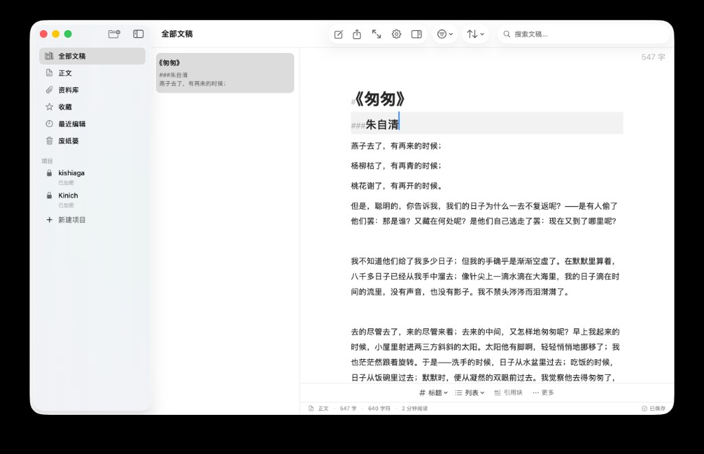
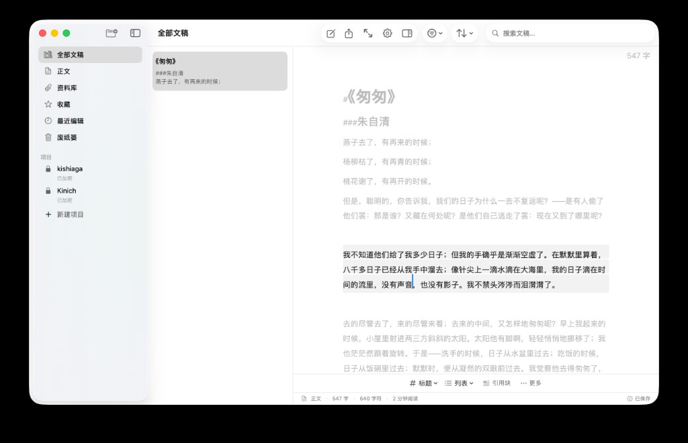
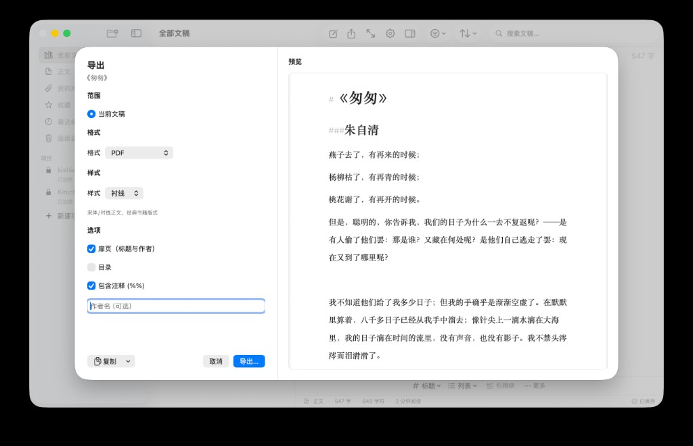
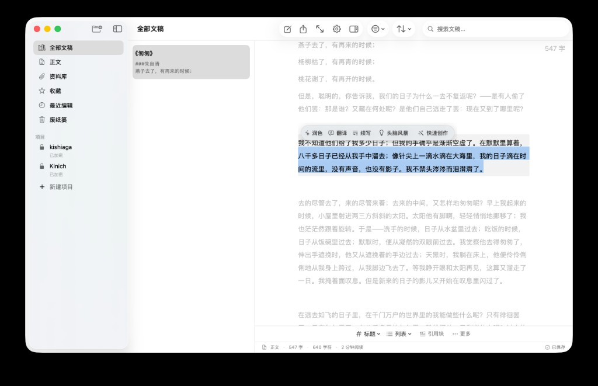
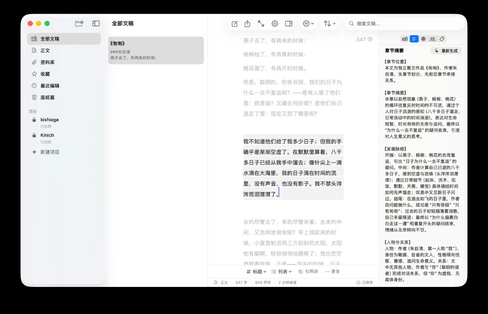

# FWriting（高仿Ulysses）

**一款带 AI 的 macOS 写作 App —— 如果你用过 [Ulysses](https://ulysses.app/)，你会立刻感到熟悉。**

FWriting 同样围绕「项目 → 文稿 → 专注写作 → 一键导出」这条主线设计：左侧是文库与项目树，中间是干净的 Markdown 编辑器，右侧是统计、摘要、人物与目标。你可以把长篇拆成无数张文稿，按章节组织，写完再导出成 PDF、Word 或 ePub。

**和 Ulysses 最大的不同？FWriting 把 AI 写进了编辑器里。** 选中文字，操作条就在光标旁边浮现；润色、翻译、续写、头脑风暴、快速创作——全部流式输出，回车就地替换，Esc 取消。不是弹个对话框把你看稿，而是 AI 真的坐在你旁边一起写。

数据全部留在本机（SwiftData），AI 走 DeepSeek API，Key 自己填、费用自己控。开源，可 fork，可改。

---

## 截图

| 编辑器 | 段落聚焦 | 导出面板 |
|:---:|:---:|:---:|
|  |  |  |

**AI 就地写作** — 选中文字，药丸条浮现，润色 / 翻译 / 续写 / 头脑风暴 / 快速创作一键可用：



**智能章节摘要** — 右侧检查器自动生成章节位置、摘要、发展脉络、人物与关系；完整续写时会引用这些上下文，长篇不断档：



---

## ✨ AI 写作助手（核心亮点）

FWriting 的 AI 不是附属功能，而是**写作流程的一部分**。

### 就地交互，不打断心流

- 选中文字 → 浮动 **AI 药丸条** 自动出现
- 选操作 → 选区旁弹出 **流式气泡**，逐字输出
- **↵ 回车** 替换或插入正文，**Esc** 放弃，不满意可重试
- 没有居中模态框，不用切窗口——写完即改，改完即写

### 五大 AI 能力

| 能力 | 做什么 | 典型场景 |
|------|--------|----------|
| **润色** | 7 种风格：标准、精简、扩写、口语↔书面、学术、保留原风格 | 改稿、统一文风、压缩篇幅 |
| **翻译** | 中/英/法/俄/哈萨克/乌兹别克/乌克兰/马来/印尼 | 多语言写作、引用翻译 |
| **续写** | 自然续写、完整续写（结合前文摘要）、补充续写（只丰富选中片段） | 卡文、补细节、接章节 |
| **头脑风暴** | 分析当前局面，给出写作方向建议；可一键「按此方向续写」 | 大纲卡住、情节转折 |
| **快速创作** | 根据梗概或短稿，扩写成约两千字正文 | 从点子快速出稿 |

### 为长篇写作做了优化

- **章节摘要**：AI 分析当前文稿，生成章节位置、内容摘要、发展脉络、人物与关系，支持重新生成
- **完整续写** 会读取前面章节的 AI 摘要（人物关系、设定、伏笔），保持长篇连贯
- **头脑风暴 → 续写** 可串联：先出方向，再按方向写下去
- 输出经过清洗，尽量去掉 AI 废话和多余前缀，直接能进正文
- 菜单栏快捷调用：`⇧⌘P` 润色 · `⇧⌘T` 翻译 · `⇧⌘U` 续写 · `⇧⌘B` 头脑风暴 · `⇧⌘Q` 快速创作

### 接入 DeepSeek，自己掌控

- 默认模型 `deepseek-v4-flash`，可在设置里切换
- API Key 存本机，不进仓库、不上传
- 推荐使用`deepseek-v4-flash`模型实测可以续写，重构，润色，任何题材任何内容的文本 支持r18+

---

## 写作体验对比

| 对比项 | 常见写作 App | FWriting |
|--------|--------------|----------|
| 组织方式 | 组 / 子组 | **多级项目** + 文稿 |
| 写作单元 | Sheet | **文稿**（正文 / 资料） |
| 文库筛选 | 收藏、关键字 | 全部、正文、资料、收藏、最近、废纸篓 |
| 编辑器 | Markdown、专注 | 轻量 Markdown 渲染、**专注模式**、打字机模式 |
| 辅助面板 | 统计、目标 | 统计、摘要、目标、**人物**、标签 |
| 导出 | 多格式发布 | Markdown / PDF / **DOCX** / **ePub** / HTML 等 |

### 编辑与心流

- 结构渲染（标题、列表等轻 Markdown 高亮）
- 当前行高亮、段落聚焦、打字机模式
- 专注模式隐藏工具栏，全屏写作
- 自动保存、版本历史、全文搜索
- 从光标处拆分文稿（长篇分章利器）

### 导出与发布

支持导出**当前文稿**或**整个项目**，格式包括 Markdown、纯文本、HTML、RTF、PDF、Word (DOCX)、ePub。导出前可预览，可选样式与作者信息。

### 隐私与安全

- **项目级加密**：整个项目可设密码，侧边栏显示锁标，未解锁前文稿不可见
- 支持 **触控 ID / 密码** 解锁（系统原生验证）
- App Sandbox，数据保存在本机


---

## 系统要求

| 项目 | 要求 |
|------|------|
| 操作系统 | macOS **26.4** 或更高 |
| 开发工具 | **Xcode**（需包含 macOS 26.4 SDK） |
| 网络 | AI 功能需联网；写作、导出可离线 |

---

## 从源码构建

```bash
git clone https://github.com/xqiuhaick/FWriting.git
cd FWriting
open FWriting.xcodeproj
```

在 Xcode 中选择 Scheme **FWriting** → 目标 **My Mac** → `⌘R` 运行。

---

## 配置 AI（DeepSeek）

1. 打开 **FWriting → 设置**（`⌘,`）
2. 进入 **DeepSeek** 标签页
3. 填入 [DeepSeek API Key](https://platform.deepseek.com/)
4. （可选）选择模型、修改 API 地址

| 项 | 默认值 |
|----|--------|
| API 地址 | `https://api.deepseek.com/chat/completions` |
| 默认模型 | `deepseek-v4-flash` |

Key 保存在本机 UserDefaults。API 调用费用由你的 DeepSeek 账户承担。

---

## 参与贡献

欢迎 Issue 和 Pull Request。

1. Fork 本仓库
2. `git checkout -b feature/your-feature`
3. 提交改动并推送
4. 发起 Pull Request

请确保本地能编译通过，且不要提交 API Key 或 `xcuserdata/` 等个人文件。

[GitHub Issues →](https://github.com/xqiuhaick/FWriting/issues)

---

## 许可证

[MIT License](LICENSE)

---

## 致谢

- [DeepSeek](https://www.deepseek.com/) — AI 能力
- Apple SwiftUI / SwiftData — 界面与本地存储
